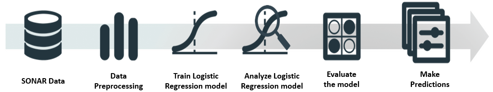

# Rock-or-Mine-prediction-with-SONAR-Data
In this project we use Logistic Regression Model to predict rock or mine using the sonar data.

### Problem statement:

Submarine has to detect the mines planted by the enemies. Mines are nothing but the explosives that explodes when some object comes in contact with it.There can also be rocks in the ocean.The submarine needs to predict whether it is crossing a mine or a rock. The task is to create a system that can predict mine or rock by sending sound signals through sonar and a review switch backs. This signal is then processed to detect whether the object is mine or a rock in the ocean.

### Sonar data:

In the laboratory setup, an experiment can be done where the sonar is used to send signals and the bounced back signals from metals and rocks are received(Ps: mines are made of metals).These received signal comprises of the sonar data for our problem.

### Workflow:

The sonar data is collected and preprocessed. Data preprocessing is an essential step in Machine Learning because the data directly affects the model's ability to learn; thus, it is critical that feed only the data which helps in better learning and the data that doesnot misguide the model. The data is then fed to a Logistic regression model(supervised learning algorithm). Logistic regression works really well for binary classification problem. Once the model is trained with the training data, we will get a trained logistic regression model. So, this model has learned from the data that how different a sonar reponse from metal is from a sonar response from a rock. Now when we give a new data, the model can predict whether the object is just a rock or it is a mine.

### REFERENCE

https://www.youtube.com/watch?v=fiz1ORTBGpY&list=PLfFghEzKVmjvuSA67LszN1dZ-Dd_pkus6&index=1

